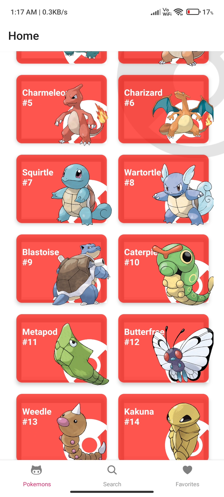
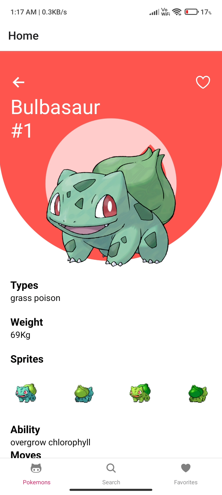
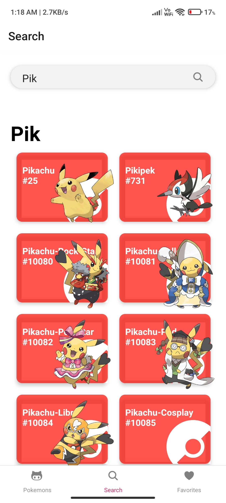

<h1>Pokedex By Shad</h1>
A Pokemon information app using React Navigation and PokeApi 
<h2>Features</h2>
Displaying all pokemones using id, name, picture. 
Adding a pokemon to favorites.(under development) 
Filtering pokemons (Under development) 
<h2>React Navigation</h2>
Handling stack of screens for pokemons, favorites and filters with createStackNavigator and createAppContainer. 
Using tabs.navigator to navigate between screens. 
Handling data from component to header with interfaces and hooks 
Using react-native-screens for better performance. 
Custom icons from ionicons 
Adding bottom tabs with react-navigation-bottom-tabs. 
Custom style on Android with react-navigation-material-bottom-tabs. 
Custom SideDrawer with react-navigation-drawer. 
<h2>Redux and React-Redux(Under Development)</h2>
Using actions and reducers to store favorite pokemons and filtered pokemons. 
Handling logic to filter recipes. 
Using hooks to pass data to the header without re-render. 
Using axios to use PokeApi 
Passing hooks to the screens with useEffect to limit re-render cycles. 
<h2>React Native</h2>
Using FlatList, TouchableOpacity, ScrollView, ImageBackground, Activityindicator. 
Custom components for pokemon card. 
Using React hooks (useState, useEffect, useRef). 
<b>Download Expo-client App on android or ios and scan the barcode to run the App</b> 

<h4>Some ScreenShots</h4>

